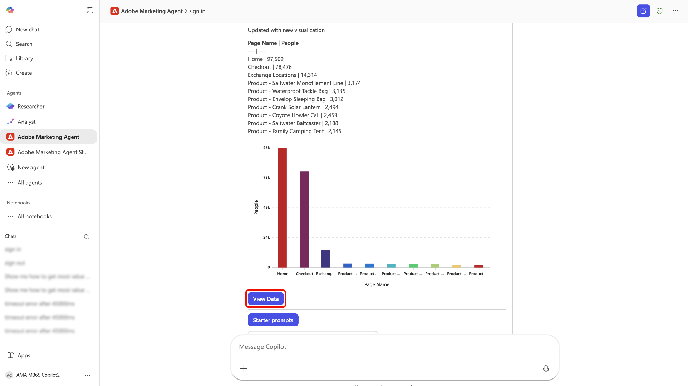

# Adobe Marketing Agent for [!DNL Microsoft 365 Copilot]

The Adobe Marketing Agent for [!DNL Microsoft 365 Copilot] is an AI-powered tool that connects Adobe Experience Platform directly to [!DNL Microsoft 365 Copilot]. With this agent, you can ask natural-language questions within [!DNL Microsoft 365] applications such as [!DNL Teams], [!DNL Word], and [!DNL Powerpoint] to instantly retrieve marketing insights from Experience Platform without interrupting your workflow.

With the Adobe Marketing Agent for [!DNL Microsoft 365 Copilot], marketing managers, analytics and insights teams, and business stakeholders can:

- Make faster, data-driven marketing decisions.
- Reduce time spent switching between tools.
- Simplify access to audience and journey insights across teams.

## How the agent works

The Adobe Marketing Agent for [!DNL Microsoft 365 Copilot] provides an integrated experience between Experience Platform and [!DNL Microsoft 365] applications:

- Adobe Marketing Agent appears as an agent in [!DNL Microsoft 365 Copilot] and [!DNL Teams].
- Sign in with your Adobe account and select the data environment (sandbox, data view) that you would like to use.

The agent connects your [!DNL Microsoft 365] instance to Experience Platform and its associated applications (Real-Time CDP, Adobe Journey Optimizer, and Customer Journey Analytics). With this integration, you can then use the Experience Platform AI Assistant and agents to retrieve relevant insights directly to your [!DNL Microsoft 365] instance. The answers returned in your [!DNL Microsoft 365] instance are presented as conversational and natural language texts, tables, and data visualizations. Additionally, support for follow-up questions and investigations are available within the same [!DNL Copilot] chat.

## Key use cases and example scenarios

| Use case | Description |
| --- | --- |
| Retrieve operational insights for audiences and customer journeys | With the Adobe Marketing Agent, you can easily retrieve operational insights across your audiences and customer journeys. You can identify which audiences are the largest or most engaged, so you can prioritize where to focus your efforts. You can see which customer journeys are currently active and learn how they are performing, helping you pinpoint opportunities for optimization. The agent also lets you track how your different segments are growing or shrinking over time, empowering you to respond to changes in your audience dynamics as they happen.  |
| Use data visualization to better analyze customer journeys and campaigns | You can review journey performance and drop‑offs, compare campaign performance over time, and understand which touchpoints drive conversions. Additionally, you can generate visual reports on campaign performance and compare these across channels, regions, or over different time periods. You can also explore trends without needing to manually build queries or dashboards. |
| Empower collaboration and decision-making | Use pre‑built "starter prompts" to explore audiences, campaigns, and web traffic. Take advantage of a natural‑language interface for easier learning of Experience Platform and Customer Journey Analytics concepts. Furthermore, you can share insights on [!DNL Teams] channels or chats during planning meetings. You can also use the Adobe Marketing Agent to answer ad-hoc questions in real-time while reviewing plans or decks, allowing you to keep stakeholders aligned on the same set of metrics and definitions. |

## Prerequisites 

Before you can use the Adobe Marketing Agent for [!DNL Microsoft 365 Copilot], you must first ensure that you have the following:

- [!DNL Microsoft 365] with [!DNL Microsoft Teams] or [!DNL Microsoft Copilot Chat].
- Experience Platform and at least one of: Real-Time CDP, Adobe Journey Optimizer, and/or Customer Journey Analytics.
- Entitlement to the Experience Platform Agent Orchestrator and agents.

## Get started

Navigate to the [!DNL Microsoft 365 Copilot] (or the application of your choice) and use the left-navigation to select **[!DNL All Agents]**.

Locate the card for [!DNL Adobe Marketing Agent] or use the search bar to manually look for the agent. Once you have the agent, select the card.

Use the pop-up window to learn more information about the agent, once you are ready, select **[!DNL Add]**.

The [!DNL Microsoft 365 Copilot] dashboard updates with the [!DNL Adobe Marketing Agent] branding now on the main page.

### Sign in and set your context

Next, prompt the agent to sign and follow the ensuing steps required to authenticate your account. During this step, you will need to copy a numerical code that the agent returns and then sign in to your Adobe organization. 

When successful, use the context setter to establish the documentation source, sandbox, and dataview that you will use for your queries.

### Use the agent to retrieve operational insights 

Once you are signed in, you can use the prompts provided in the main page to get started. You can also take advantage of a starter prompt that can branch out to analyzing marketing audiences, reviewing campaign performances, and monitoring campaign journeys. For example, select **[!DNL Review campaign performance]** and then select **[!DNL Analyze engagement - Show web visitors for top 10 products last week]**

Allow for a few moments for the agent to calculate and then the agent responds with a visualized representation of your data. You can use the bar chart presented or you can select **[!DNL View data]** to view the data in tables.

You can further investigate by selecting follow up questions that the agent recommends. Alternatively, you can pivot and try different starter prompts, verify the information sources that the agent referenced, or provide feedback using the feedback mechanism.

For more information on the AI Assistant UI features, read the guide on [using the AI Assistant](../ai-assistant/ai-assistant-ui.md).

## Security, Privacy, and Responsible AI

**Data handling and governance**

The Adobe Marketing Agent relies on the same controls and governance that apply to Experience Platform and [!DNL Microsoft 365]. Your organization retains ownership and control of its data.

**Responsible AI use**

The agent is intended to return read‑only insights and does not modify your customer data in Experience Platform. You should review any generated summaries and analyses before you use them to make business decisions.

**Supported languages and scope**

The initial release is available as an English‑language experience. Capabilities are limited to read‑only insights; the agent does not create or update marketing assets or configurations.