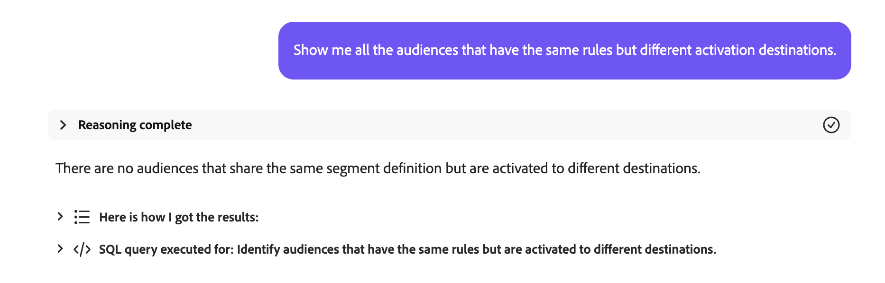
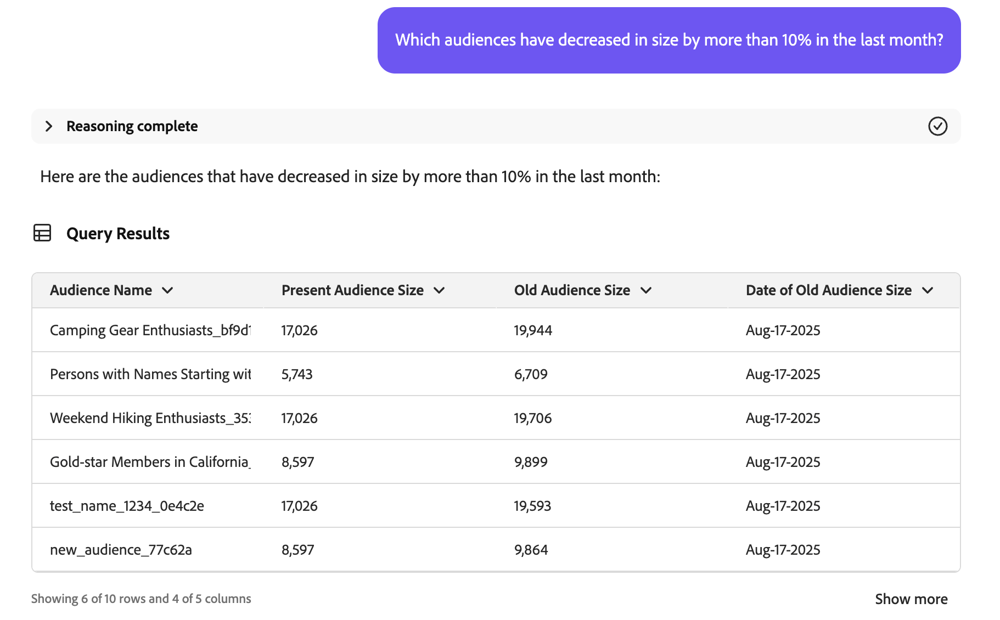

# Audience Agent

>[!AVAILABILITY]
>
>The Audience Agent is available for all customers who have access to AI Assistant. However, you will need the following permissions in order to fully use the Audience Agent features.
>
>**View Segments**: This permission lets you use the Audience Agent to view insights into the audiences directly in AI Assistant.
>
>**Manage Segments**: To permission lets you use the Audience Agent to create new audiences directly in AI Assistant.

The Audience Agent lets you view insights about audiences, including detecting significant audience size changes, detecting duplicate audiences, exploring your audience inventory, and retrieving your audiences' size.

## Supported use cases

The Audience Agent within AI Assistant supports the following use cases:

- Conversationally explore your audience
  - Find audience sizes of existing audiences
  - Look for audiences based on full or partial attributes named
  - Detect duplicate audiences
  - Discover XDM fields you can use to define an audience
- Detect significant changes in audience size
  - This lets you find audiences that have suddenly grown or shrunk, letting you better analyze potential market changes

<!-- - Find your audience size and detect significant changes in audience size
  - This lets you find audiences that have suddenly grown or shrunk, letting you better analyze potential market changes
- Detect duplicate audiences
  - This lets you reduce redundancies with your created audiences
- Find audiences based on full or partial attributes named
  - This lets you more easily navigate through your audience inventory
- Discover XDM fields you can use to define an audience
  - This skill lets you more easily identify the right fields to use in your audience based on context and relevance -->

The Audience Agent does not **currently** support the following features:

- Knowledge-based audience creation
  - Knowledge-based audience creation is creating an audience based on the given attributes and events
  - Additionally, you can estimate the potential size of the audience prior to audience creation. This lets you quickly iterate on the most effective audience before it's ready to activate
  - Support for this feature is coming soon
- Goal-based audience exploration
  - Goal-based audience exploration lets you discover relevant datasets and profiles aligned to a business goal by applying machine learning models such as propensity to buy or convert.

Additionally, when using Audience Agent, you should keep the following constraints in mind:

- Audience Agent needs at least 24 hours to process your data
  - For example, you **cannot** have a query that looks for data within the last 24 hours. You'll need to look within the last 48 hours, at a minimum.
- Audience Agent only supports the following audience types:
    - **People-based** audiences that are evaluated using batch segmentation
    - **Account-based** audiences for the following use cases:
      - Conversational audience exploration
      - Duplicate audience detection

## Sample prompts

The following examples demonstrate sample prompts and responses for the Audience Agent.

### Conversational audience exploration

Show me fields for affluent buyers.

+++ Response

+++

Which audiences have not been activated or used in any campaign in the last 30 days?

+++ Response

+++

List all the audiences that have been mapped to new destinations in the last 3 months.

+++ Response

+++

Which account audience has the largest audience size and what is that size?

+++ Response

+++

### Detect duplicate audiences

Do I have any audiences with identical or similar descriptions?

+++ Response

+++

Identify audiences that have the same rules but have different names.

+++ Response

+++

Show me all the audiences that have the same rules but different activation destinations.

+++ Response

+++

Identify account audiences that have the same rules but have different names.

+++ Response

+++

### Retrieve audience size

What is the current size of my audience "Gold-star Members in California_f153e1"?

+++ Response

+++

What is my biggest audience?

+++ Response

+++

### Detect significant changes in audience size

Which audiences have increased in size by more than 20% in the last week?

+++ Response

+++

Which audiences have decreased in size by more than 10% in the last month?

+++ Response

+++

What is my fastest growing audience?

+++ Response

+++

## Next steps

After reading this guide, you should have a better understanding of Audience Agent and what features it supports. For more information on agents in Adobe Experience Platform, read the [Agent Orchestrator overview](./agent-orchestrator.md).

