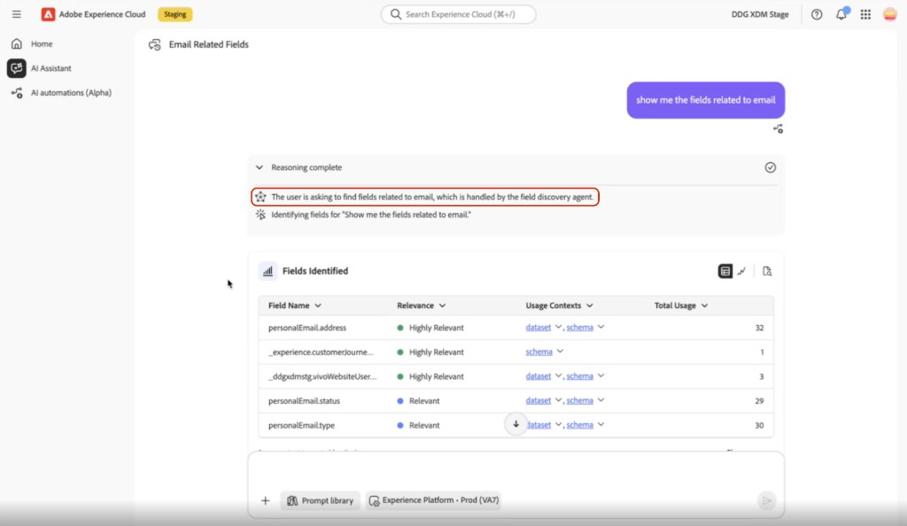

# Field Discovery Agent

When building segments, creating audiences, or onboarding data in Adobe Experience Platform, identifying the correct XDM field for a business concept often requires manually browsing schemas or knowing in advance exactly how a field is named. Different fields may represent the same concept under different names — for example, state, region, and location may all refer to geographic data — and choosing the wrong one introduces errors in downstream workflows. Field Discovery Agent removes that manual step.

Field Discovery Agent is an AI-powered agent in Adobe Experience Platform that helps you find, evaluate, and select XDM fields using natural language queries in AI Assistant. You describe what you are looking for in plain language — a business concept, a workflow goal, or a specific field name — and the agent searches across your schemas, datasets, and metadata to return ranked field suggestions with supporting context.

You can invoke Field Discovery Agent directly in AI Assistant, or it runs automatically when other AEP agents need to resolve field or entity references on your behalf. In both cases, Field Discovery Agent surfaces field information only. It does not modify schemas, datasets, or audiences, and it respects your existing access controls and sandbox context.

## Availability and permissions {#availability-and-permissions}

To use Field Discovery Agent directly in AI Assistant (as opposed to through other agents that call it automatically), you must:

- Have access to Adobe Experience Platform and AI Assistant.
- Be working in the correct IMS organization and sandbox.
- Have access to the schemas and datasets you intend to query.

[UNVERIFIED: Whether a separate Field Discovery Agent permission exists in the Permissions UI or Adobe Admin Console, distinct from the general AI Assistant access permissions.]

For instructions on enabling AI Assistant access and granting the required permissions, see the [Agent Orchestrator access guide](./agent-orchestrator.md#access).

## Field Discovery Agent skills {#field-discovery-agent-skills}

Field Discovery Agent provides four skills within AI Assistant. Each skill supports a different stage of field exploration, from identifying candidate fields to verifying that a specific field meets your needs.

| Skill | Description | When to use it | Expected output |
| --- | --- | --- | --- |
| **Identification** | Identifies XDM fields that semantically match a business concept or attribute you describe in natural language. | When you know what data you need but not which field holds it. | A ranked list of candidate fields with relevance labels, field paths, and Usage Contexts links. |
| **Recommendation** | Recommends XDM fields based on a workflow goal or use case you describe, such as building an audience segment or modeling a behavioral attribute. | When you are starting a new use case and need guidance on which fields to include. | A prioritized list of fields relevant to the stated goal, with relevance context for each. |
| **Classification** | Categorizes fields by semantic type, data category, or functional role. | When you need to understand what type of data a field or group of fields holds before using them in queries or segment definitions. | A classification summary indicating each field's category or type. |
| **Enrichment** | Returns detailed context for a specific field, including sample values, schema location, and where the field is used across datasets, audiences, and destinations. | When you have identified a candidate field and want to verify it is the right one before using it. | Field details including sample values, schema path, associated datasets, and audience or destination usage. |

If your situation could fit more than one skill, use **Identification** when you have a specific concept in mind (for example, "email consent status"), and **Recommendation** when your starting point is a broader workflow goal (for example, "build a churn audience"). Use **Enrichment** after either to verify a specific candidate before using it in a segment or query.

## How Field Discovery Agent works {#how-field-discovery-agent-works}

When you submit a query in AI Assistant, Field Discovery Agent processes your request in three stages.

**Intent interpretation.** The agent reads your natural language input and identifies the underlying concept or goal. For example, a query about "people in California" is interpreted as a geographic attribute request, not a literal string match. The agent maps your phrasing to semantically equivalent concepts that may appear under different names across your schemas.

**Search scope.** The agent searches across the XDM schemas, datasets, and field metadata available in your current IMS organization and sandbox. It considers field names, display names, descriptions, and usage associations to find candidates that align with your intent.

**Ranking.** The agent ranks results by semantic relevance — how closely a field matches your stated intent — supplemented by signals such as metadata completeness and field usage across your data ecosystem. Fields with descriptive names, populated metadata, and confirmed usage in active datasets rank higher than fields that exist only in a schema definition. The agent does not expose the specific weights assigned to individual signals.

Results are returned as a ranked list with relevance indicators, sample values, and usage context to help you evaluate each candidate field. If results are consistently lower relevance, this often indicates that the concept you described is not well represented in your current schema metadata — using terminology that matches how your fields are named, or adding more specific context to your query, typically improves the result set.

## Understand your results {#understand-your-results}

Field Discovery Agent returns a structured result set for each query. Understanding the components of a result helps you evaluate candidate fields and act on them with confidence, without additional trial and error.

### Relevance labels

Each field result is assigned a relevance label in the **[!UICONTROL Relevance]** column of the **[!UICONTROL Fields Identified]** panel, indicating how closely the field matches your query. [UNVERIFIED: whether a third, lower-relevance label exists in addition to those below.]

- **Highly Relevant** — The field strongly matches your stated concept based on its name, metadata, and usage signals. Confirm the field path and review its sample values to verify it holds the data you expect.
- **Relevant** — The field partially matches your query. It may share semantic overlap but differ in scope, specificity, or data type. Review the sample values and usage context before deciding whether to use it.

If all results are labeled **Relevant** rather than **Highly Relevant**, your query may be too broad or use terminology that does not match your schema metadata. Refine your prompt with more specific language or domain terms that reflect how your fields are named.

### Sample values

Alongside each field suggestion, Field Discovery Agent surfaces sample values drawn from the field's data in your sandbox. Sample values help you verify that a field contains the type of data you expect before selecting it.

>[!IMPORTANT]
>
>Sample values may contain personally identifiable information (PII). They are governed by your existing dataset access permissions — only fields you are authorized to access return sample values. Do not share sample values outside of secure internal workflows.

If no sample values appear for a field, the field may be empty in your current sandbox, or your permissions may not include access to its underlying dataset.

### Usage context

Each field result includes usage context showing where the field appears across your data ecosystem:

**Schema → Dataset → Audience → Destination**

A field that appears in an active dataset, is used in a published audience, and is mapped to a live destination has demonstrated real usage in your environment. This distinguishes fields that are actively relied on from fields that exist only in a schema definition but have not been used in practice. Use this signal alongside relevance label and sample values to make a more informed field selection.

### Results in AI Assistant

Field Discovery Agent returns results in a **[!UICONTROL Fields Identified]** panel within the AI Assistant response. The panel displays a table with four columns:

- **[!UICONTROL Field Name]** — The XDM path of the candidate field.
- **[!UICONTROL Relevance]** — The relevance label assigned to the field (**Highly Relevant** or **Relevant**).
- **[!UICONTROL Usage Contexts]** — Links to the datasets and schemas where the field appears. Select **[!UICONTROL dataset]** or **[!UICONTROL schema]** to open a side panel showing where the field is used across datasets or schemas.
- **[!UICONTROL Total Usage]** — The number of times the field appears across your data ecosystem.

A **[!UICONTROL Results Explained]** section appears below the **[!UICONTROL Fields Identified]** table and provides additional field-level context, including explanations and supporting detail for each result.

>[!NOTE]
>
>**SME clarification needed:** The **[!UICONTROL Fields Identified]** panel shows multiple icons in the top-right corner of the UI, but their functionality is not yet documented. Questions for SME review: What actions do these icons perform (for example, copy, expand, export, or refresh)? Are any of these considered primary user actions that should be included in the documented workflow? Should users rely on these icons as part of the field selection or extraction process? Until confirmed, these controls are intentionally not described to avoid introducing incorrect guidance.

## Use Field Discovery Agent {#use-field-discovery-agent}

You interact with Field Discovery Agent through AI Assistant using natural language. The agent requires a clear statement of intent — a vague or overly brief query produces lower-quality results or may not invoke Field Discovery Agent at all.

To use Field Discovery Agent:

1. Open AI Assistant from any enabled Experience Platform application.
2. State your intent explicitly in the input field. Describe the concept, goal, or field characteristic you are looking for. For example: *"Find fields related to customer email opt-out status."*

   

3. Review the ranked results in the **[!UICONTROL Fields Identified]** panel. Each row includes a relevance label and an XDM field path in the **[!UICONTROL Field Name]** column.
4. Select **[!UICONTROL dataset]** or **[!UICONTROL schema]** in the **[!UICONTROL Usage Contexts]** column to open a side panel showing where the field is used. For additional field-level context, see the **[!UICONTROL Results Explained]** section below the results table.
5. Read the XDM field path from the **[!UICONTROL Field Name]** column for the field that best matches your needs. Use this path in the downstream tool where you are building your segment, audience, or query — for example, when defining a segment rule in Real-Time CDP or constructing a query in Query Service. Field Discovery Agent does not insert the field into other tools; it provides the field reference for you to use.
6. To confirm that Field Discovery Agent handled your request, select the **[!UICONTROL Reasoning complete]** dropdown above the response. The reasoning panel indicates which agent was called.

For guidance on the AI Assistant interface, see the [AI Assistant UI guide](../ai-assistant/ai-assistant-ui.md).

>[!NOTE]
>
>If the reasoning panel does not indicate Field Discovery Agent, your query may not have contained a clear field discovery intent. Restate your query with explicit field-finding language and resubmit. See [Troubleshooting](#troubleshooting) for common invocation issues.

## Supported use cases {#supported-use-cases}

The following sections describe each of Field Discovery Agent's four skills with representative scenarios and example prompts. For result interpretation, see [Understand your results](#understand-your-results).

Field Discovery Agent returns field information only — it does not create audiences, execute queries, or push data into other tools. After identifying the right field, read its XDM path from the **[!UICONTROL Field Name]** column in the **[!UICONTROL Fields Identified]** panel and use that path in the downstream tool where you are building your segment, query, or schema mapping.

### Identify fields for a business concept

Use the Identification skill when you know the data attribute you need but not the specific XDM field that holds it.

Describe the concept in plain language. Field Discovery Agent interprets your intent and returns a ranked list of fields that semantically match your description.

> "Which fields represent a customer's home state or province?"
> "Find fields related to purchase transaction date."
> "What fields contain information about email marketing consent?"

The response lists candidate fields with their relevance label and XDM path in the **[!UICONTROL Fields Identified]** panel. Fields labeled **Highly Relevant** most closely match your stated concept. If the top results are labeled **Relevant** rather than **Highly Relevant**, refine your query using more specific terminology or field-level context. Once you identify the right field, read its XDM path from the **[!UICONTROL Field Name]** column and use it in the downstream tool where you are building your segment, audience, or query.

### Get field recommendations for a use case

Use the Recommendation skill when you are starting a workflow — such as building a segment, onboarding a dataset, or preparing a query — and need guidance on which fields to include.

Describe your goal or use case. Field Discovery Agent recommends fields aligned to that objective, prioritized by relevance.

> "I want to build an audience of high-value customers. What fields should I use?"
> "Recommend fields for modeling purchase propensity."
> "What fields should I include when onboarding a retail transaction dataset?"

The response returns a prioritized list of fields with relevance context. Review the usage context for each recommended field to confirm it is actively used in your environment. Once you have identified the fields you need, read their XDM paths from the **[!UICONTROL Field Name]** column and use them in the downstream tool where you are building your segment, audience, or query.

### Classify fields

Use the Classification skill when you need to understand the semantic type, data category, or functional role of a field or set of fields before using them.

Describe the fields or field group you want to classify.

> "What type of data does `commerce.order.priceTotal` hold?"
> "Which fields in my profile schema relate to location data?"
> "Which of these fields contain behavioral data versus demographic data?"

The response categorizes each field by type or functional role. This result is informational — it supports decisions about field selection, governance, or schema design but does not produce a field path for direct use in a downstream workflow. Use the classification to determine which fields to investigate further using the Identification or Enrichment skill.

### Enrich field context

Use the Enrichment skill when you have identified a candidate field and want to verify it is the right one before using it in a segment, query, or mapping.

Ask about a specific field by name or path.

> "Tell me more about the field `person.name.lastName`."
> "What sample values exist for `homeAddress.stateProvince`?"
> "Where is the field `commerce.purchases.value` used across my datasets and audiences?"

The response returns the field's sample values, schema location, associated datasets, and any audiences or destinations where the field appears. Review this context to confirm the field holds the data you expect. Once verified, read the XDM path from the **[!UICONTROL Field Name]** column and use it in the downstream tool where you are building your segment, query, or schema mapping.

## Field Discovery Agent in other agents {#field-discovery-in-other-agents}

Field Discovery Agent also runs automatically as an underlying capability within other AEP agents. When those agents need to resolve natural language references to XDM fields, audiences, or data entities, they call Field Discovery Agent to perform that resolution. You do not need to invoke Field Discovery Agent separately — it operates in the background to improve the accuracy of the agent you are working with.

To confirm that Field Discovery Agent was involved in a response from another agent, see step 6 in [Use Field Discovery Agent](#use-field-discovery-agent).

The following agents currently use Field Discovery Agent:

### Knowledge Base Audience Agent

When you ask the Knowledge Base Audience Agent to create an audience using a natural language description, Field Discovery Agent resolves the XDM fields required to define the segment conditions. For example, if you request an audience of "customers who purchased in the last 30 days," Field Discovery Agent identifies the purchase event and date fields needed to generate the segment definition, which the Audience Agent then uses to build and persist the audience.

For full audience creation guidance, see [Audience Agent](./audience.md).

### Goal-Based Audience Agent

When you describe a business goal to the Goal-Based Audience Agent — such as increasing loyalty program enrollment or reducing churn — Field Discovery Agent resolves the XDM fields required to build segment conditions aligned to that goal. The resolution process is the same as in the Knowledge Base Audience Agent; the difference is that the input starts from a business objective rather than a specific audience description.

### Operational Insights

When you ask Operational Insights questions about your AEP environment, Field Discovery Agent resolves entity references in your query — identifying the correct datasets, schemas, journeys, attributes, sources, and audiences by name. This allows the Operational Insights agent to handle approximate names and partial references accurately. For example, if you refer to a dataset by an informal or shortened name, Field Discovery Agent matches it to the correct entity in your organization.

### Time Series

When you submit a natural language query to the Time Series agent that references an audience by name or ID, Field Discovery Agent resolves the correct audience entity. This prevents the agent from querying the wrong audience when names are inexact or when an audience ID is used in place of its display name.

>[!NOTE]
>
>Data Engineering Agent is a planned future consumer of Field Discovery Agent. In that context, Field Discovery Agent will support XDM field mapping during the data modeling stage of schema creation. This capability is not yet available.

## In scope and out of scope {#in-scope-and-out-of-scope}

This section summarizes what Field Discovery Agent can and cannot do. For detailed task guidance, see [Supported use cases](#supported-use-cases). For platform constraints, see [Guardrails and limitations](#guardrails-and-limitations).

### In scope

Field Discovery Agent supports:

- Identifying XDM fields that match a business concept or natural language description.
- Recommending fields for a stated workflow goal or use case.
- Classifying fields by semantic type, data category, or functional role.
- Enriching a specific field with sample values, schema location, and usage context.
- Returning results ranked by semantic relevance, labeled Highly Relevant or Relevant.
- Surfacing sample values within your authorized dataset permissions.
- Operating as an underlying field and entity resolution capability within Knowledge Base Audience Agent, Goal-Based Audience Agent, Operational Insights, and Time Series.

### Out of scope

Field Discovery Agent does not:

- Modify schemas, datasets, fields, or audiences.
- Create or publish audiences or segments.
- Execute queries or activate data to destinations.
- Access fields or datasets outside your authorized permissions.
- Expose internal embedding logic, vector database architecture, or entity linking implementation details.
- Guarantee a specific time window for knowledge base updates after schema or dataset changes.

## Guardrails and limitations {#guardrails-and-limitations}

Field Discovery Agent operates within platform-level constraints that affect result availability and quality. Understanding these constraints helps you interpret results accurately and troubleshoot unexpected gaps.

### Knowledge base hydration

Field Discovery Agent relies on a knowledge base that is periodically refreshed with schema and metadata from your AEP environment. Results reflect the state of the knowledge base at the time of your query — not the real-time state of your schemas.

New schemas, fields, or datasets added to your environment may not appear in Field Discovery Agent results immediately. Results may take time to reflect recent changes.

>[!NOTE]
>
>The refresh interval for the knowledge base is subject to change. If a recently added field does not appear in results, allow time for the knowledge base to update and then resubmit your query.

### Metadata quality and coverage

Result quality depends on the quality and completeness of field metadata in your AEP environment. The agent uses field names, display names, descriptions, and usage associations to rank results. Fields with poor or missing metadata may not surface in results or may rank lower than expected.

If you have schema editing access, you can improve result quality by:

- Using clear, descriptive display names for fields in your schemas.
- Adding field descriptions where possible.
- Associating fields with active datasets rather than leaving them as schema-only definitions.

If you do not have schema editing access and results are consistently poor, contact your AEP administrator or data engineering team to review field metadata for the schemas you work with.

### Access and PII constraints

Field Discovery Agent respects all existing AEP access controls and operates within your current sandbox context. You only receive results for fields in schemas and datasets you are authorized to access.

Sample values are governed by the same dataset-level permissions. Fields in profile-enabled datasets with PII restrictions return sample values only if you have the required access. See [Sample values](#sample-values) for handling guidance. Field Discovery Agent does not bypass field-level security or profile-enabled access restrictions.

## Best practices {#best-practices}

Use the following guidance to get accurate, actionable results from Field Discovery Agent.

- **Be specific about the concept, not just the field type.** A prompt like "find a state field" produces lower-quality results than "find the field that holds a customer's US state for geographic segmentation." Specificity gives the agent more signal to match against your metadata. See [How Field Discovery Agent works](#how-field-discovery-agent-works) for why this matters.
- **Use terminology that matches your schema metadata.** If your schemas use the term "transaction" rather than "purchase," use "transaction" in your prompts. The agent matches against actual field names and descriptions, not just general concepts.
- **Use Enrichment to verify before committing.** After identifying a candidate field with the Identification or Recommendation skill, use the Enrichment skill to review its sample values and usage context before using it in a segment or query. This reduces the risk of selecting the wrong field.
- **Iterate when results are Relevant rather than Highly Relevant.** Rephrase your query with different terminology or add more context about your use case. A second, more specific query often surfaces better candidates.
- **Include scope context in your prompts.** For geo-based segmentation, include the target region. For time-based queries, include the time attribute. The more context you provide, the more targeted the result ranking.

## Example prompts {#example-prompts}

Use this section as a quick-reference prompt library. If you are new to Field Discovery Agent, read [Best practices](#best-practices) and [Supported use cases](#supported-use-cases) first to understand when and why to use each skill.

### Identification prompts

> "Which field holds a customer's state or region?"
> "Find fields related to email subscription status."
> "What field contains the date of a customer's first purchase?"
> "Identify fields that represent customer lifetime value."
> "Which fields in my profile schema relate to loyalty program membership?"

### Recommendation prompts

> "What fields should I use to build a re-engagement audience?"
> "Recommend fields for an audience targeting customers who have not purchased in 90 days."
> "What fields are most useful for modeling churn risk?"
> "Suggest fields I should include when creating a geographic segmentation."
> "I am building a propensity-to-buy model. Which fields should I start with?"

### Classification prompts

> "What type of data does `commerce.order.currencyCode` hold?"
> "Classify the fields in my ExperienceEvent schema that relate to web behavior."
> "Which of my profile fields contain behavioral data versus demographic data?"
> "Is `person.birthDate` considered a PII field?"

### Enrichment prompts

> "Tell me more about `homeAddress.stateProvince`."
> "Show me sample values for `commerce.purchases.value`."
> "Where is `person.name.lastName` used across my datasets and audiences?"
> "What datasets contain the field `web.webPageDetails.URL`?"
> "Is `segmentMembership` mapped to any active destinations?"

## Troubleshooting {#troubleshooting}

Use this section when results are missing, unexpected, or when you are unsure whether Field Discovery Agent handled your request.

- **A recently added field does not appear in results.** The knowledge base may not yet reflect the new schema or field. Allow time for the knowledge base to update after adding schemas or fields to your environment, then resubmit your query. See [Knowledge base hydration](#knowledge-base-hydration).

- **All results are labeled Relevant rather than Highly Relevant.** Your query may be too broad, or the terminology you used may not match your field metadata. Refine your prompt with more specific language or terms that align with how your fields are named in your schemas. See [Best practices](#best-practices).

- **Field Discovery Agent was not invoked.** You submitted a query in AI Assistant but the **[!UICONTROL Reasoning complete]** panel does not indicate Field Discovery Agent. Your query may not have contained a clear field discovery intent. Restate your query explicitly — for example, "Find the field that holds customer email opt-out status" — and resubmit. See [Use Field Discovery Agent](#use-field-discovery-agent).

- **Sample values are not appearing for a field.** The field may be empty in your current sandbox, or your permissions may not include access to its underlying dataset. Confirm your dataset access permissions and verify the field is populated with data. See [Access and PII constraints](#access-and-pii-constraints).

- **Results include fields from schemas you did not expect.** Field Discovery Agent searches all schemas and datasets in your current sandbox that are accessible under your permissions. If unexpected results appear, confirm your active sandbox context in AI Assistant and verify which schemas and datasets are accessible to your role.

To verify which agent handled your request, see step 6 in [Use Field Discovery Agent](#use-field-discovery-agent).
