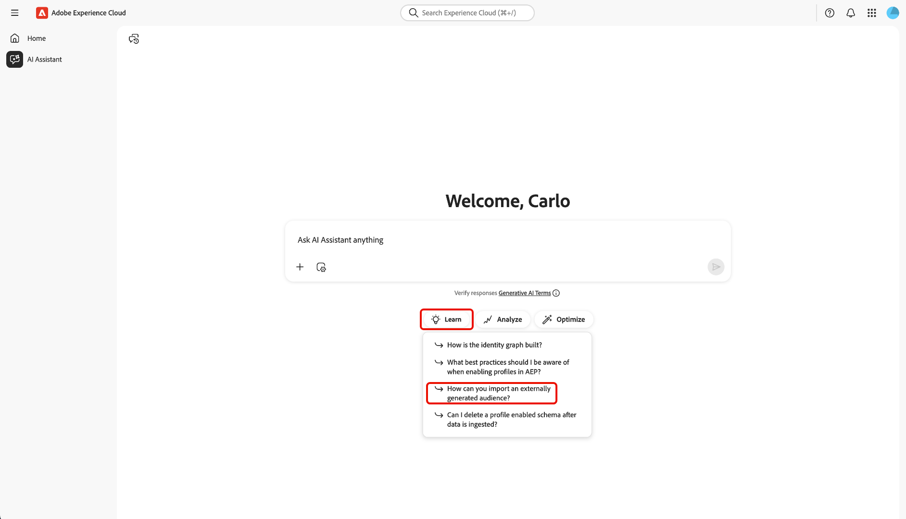
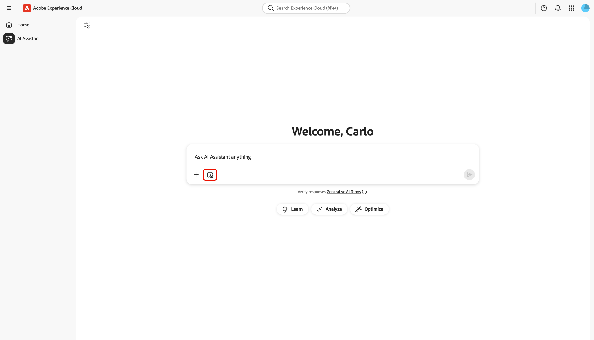

# AI Assistant

**AI Assistant** is a conversational experience that you can use to accelerate and optimize workflows across Adobe Experience Cloud applications. You can use AI Assistant to access Adobe Experience Platform Agents and other AI capabilities. 

Read this guide to learn how you can use AI Assistant.

## Access AI Assistant

There are several ways to access AI Assistant.

In the Experience Cloud home interface, select **[!UICONTROL AI Assistant]** from the left-navigation to launch a full-screen view of AI Assistant.

+++Select to view

+++

You can also launch AI Assistant from the home pages of Experience Cloud applications such as Experience Platform, Adobe Journey Optimizer, and Customer Journey Analytics. Navigate to your product home page and then select the **AI Assistant icon** from the top header to launch the AI Assistant chat panel on the right rail..

+++Select to view

+++

## Navigate the AI Assistant user interface

Read this section to learn how you can navigate the AI Assistant interface.

### Full screen view

The AI Assistant interface includes several key elements to help you interact effectively:

1. **[!UICONTROL Conversations]**: Select the **[!UICONTROL Conversations]** icon to start a new conversation and access recent conversations from your history. For more information, read the section on [conversations](#conversations).
2. **Input box**: Select the input box to enter questions and prompts for AI Assistant. For more information, read the section on [input features](#input-features).
3. **Data and object autocomplete**: - Select the plus icon to use data and object suggestion and autocomplete. When selected, you can use a pop-up window to select suggested entities. For more information, read the section on [data and object autocomplete](#autocomplete).
4. **Context setting**: - Select the Context setting icon to configure information sources for AI Assistant. You can use this tool to configure the application, sandbox, and dataview that AI Assistant references in order to answer your query. For more information, read the section on [context setting](#context-setting).
5. **Discovery**: - Select **[!UICONTROL Learn]**, **[!UICONTROL Analyze]**, and **[!UICONTROL Optimize]** to view sample queries that you can use to get started. For more information, read the section on [discoverability prompts](#discoverability-prompts).

### Rail view

The rail view provides quick access to chat, discovery prompts, updates, conversations, and interface controls in a compact panel.

1. **[!UICONTROL Chat]**: Select **[!UICONTROL Chat]** from the header to return to your conversation in the event that you left to access different elements on the interface.
2. **[!UICONTROL Discovery]**: Select **[!UICONTROL Discovery]** to view a list of AI Assistant prompts organized by category. You can use these pre-configured prompts to populate your chat. Additionally, you can tweak the suggested prompts to meet your particular use case.
3. **[!UICONTROL What's New]**: Select **[!UICONTROL What's New]** to view a list of the latest updates available to AI Assistant.
4. **[!UICONTROL Conversations]**: Select the **[!UICONTROL Conversations]** icon to start a new conversation and access recent conversations from your history. For more information, read the section on [conversations](#conversations).
5. **Full screen view**: Select the **[!UICONTROL Full screen view]** icon to change your AI Assistant interface from the right rail to full screen mode.
6. **Data and object autocomplete**: Select the plus icon to use data and object suggestion and autocomplete. When selected, you can use a pop-up window to select suggested entities. For more information, read the section on [data and object autocomplete](#autocomplete).
7. **Context setting**: Select the Context setting icon to configure information sources for AI Assistant. You can use this tool to configure the application, sandbox, and dataview that AI Assistant references in order to answer your query. For more information, read the section on [context setting](#context-setting).

## Input features

### Discovery prompts

You can use AI Assistant's discovery feature to view a list of the general subjects, grouped into entities, that AI Assistant supports. Discovery prompts are different depending on your starting point.

>[!BEGINTABS]

>[!TAB Use discovery from the full screen view]

From the full screen view, discovery prompts are grouped into three categories:

| Discovery | Description | Example prompts |
| --- | --- | --- |
| Learn | Select **[!UICONTROL Learn]** for prompts focused on product knowledge. |
| Analyze | Select **[!UICONTROL Analyze]** for prompts focused on operational insights surrounding your datasets. |
| Optimize | |

To use discovery prompts to advance product knowledge, select **[!UICONTROL Learn]** and then select a prompt from the dropdown window that appears.

>[!TAB Use discover from the rail view]

Select **[!UICONTROL Discovery]** from the rail view to access an extensive list of discovery prompts that you can use to get started and populate your chat with AI Assistant.

>[!ENDTABS]

Select a prompt to populate the input box. From here, you can edit the prompt to fit your particular use case. When ready, select the send icon on the right to submit your query.

.

## Interacting with responses

### Check for reasoning process {#reasoning}

1. Rich response cards
2. CSV export
3. Object menu
4. Sources and confidence scores
5. Feedback

AI Assistant then queries its knowledge base and computes an answer. After a few moments, AI Assistant returns an answer, including options to dive deeper into its reasoning process, related suggestions, information sources, and feedback tools.

To better understand the underlying reasoning process, select **[!UICONTROL Reasoning complete]**.

The *[!UICONTROL Reasoning complete]* window expands to display a summary of your request and details on how the response was crafted.

### Use related suggestions

Next, navigate down to the bottom of the response and select **[!UICONTROL Related suggestions]** to receive a list of prompts relating to your initial query. You can use these prompts to further continue your conversation with AI Assistant.

### View sources

To verify AI Assistant's response, select **[!UICONTROL Sources]** to view a list of information sources that AI Assistant referenced when calculating it's response.

### Provide feedback

You can provide feedback of your experience with AI Assistant using the options provided with answer.

To provide feedback, select either thumbs up or thumbs down after receiving a response from AI Assistant, and then input your feedback in the provided text box. 

>[!BEGINTABS]

>[!TAB Thumbs up]

Select **[!UICONTROL Thumbs up]** to provide positive feedback. You can optionally select from a list of positive feedback or use the input box to enter your own specific feedback. 

+++Select to view

You can also select **[!UICONTROL Detailed feedback]** to further elaborate on your feedback. When finished, select **[!UICONTROL Submit]**.

.

+++

>[!TAB Thumbs down]

Select **[!UICONTROL Thumbs down]** to provide constructive feedback. You can optionally select from a list of constructive feedback or use the input box to enter your own specific feedback. 

+++Select to view

Similarly, you can also select **[!UICONTROL Detailed feedback]** to further elaborate on your feedback. When finished, select **[!UICONTROL Submit]**.

.

+++

>[!ENDTABS]

### Use the split-view feature

If AI Assistant's response includes an image, you can select the path icon to launch a split-view mode. This allows you to read the entirety of AI Assistant's response with contextual image displayed on the right.

## Conversations

You can use the *[!UICONTROL All conversations]* panel to reset and revisit conversations with AI Assistant. Select the **[!UICONTROL Conversations]** icon to view the *[!UICONTROL All conversations]* window.

To revisit a previous conversation, select the conversation topic from the list provided. 

To start a new conversation, select **[!UICONTROL New conversation]**.

## Context setting {#context-setting}

Use the context setting feature of AI Assistant to configure the **application**, **sandbox**, and **dataview** that AI Assistant references to answer your query. To access context setting, select the **[!UICONTROL Context setting]** icon from the input box.

The *[!UICONTROL Answer from...]* pop-up window appears. Use this window to configure the information sources that you want to use and then select **[!UICONTROL Set context]**.

| Information source | Description | Examples |
| --- | --- | --- |
| App | The Experience Cloud application that your query pertains to. | Experience Platform, Journey Optimizer, Customer Journey Analytics, etc. |
| Sandbox | The sandbox that contains the dataset(s) or information that your query pertains to. | Prod (VA7), Dev. |
| Dataview | When you're using AI Assistant with Customer Journey Analytics, the dataview setting helps the Data Insights Agent understand: <ul><li>Which datasets to query</li><li>What data components are available</li><li>How to structure responses about your data</li><li>Which visualizations to create in Analysis Workspace</li></ul> |

## Data and object autocomplete

You can use the autocomplete function to receive a list of data objects that exist in your sandbox. To use autocomplete, input the plus symbol (+) in your query. As an alternative, you can also select the plus sign (+) located at the bottom of the text input box. A window appears with a list of recommended data objects from your sandbox.

![The data and object autocomplete button selected.]

## Configure data visualization