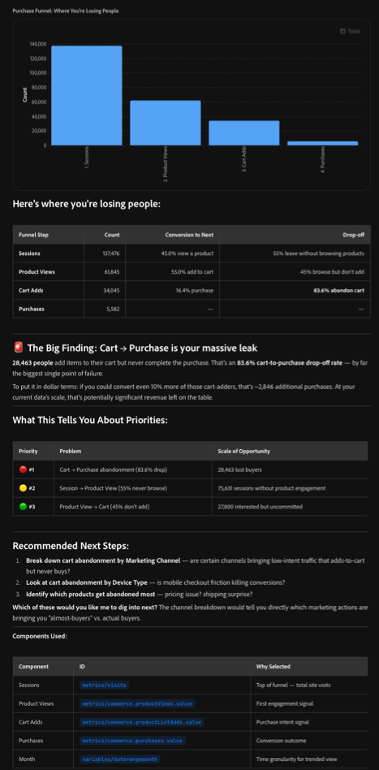
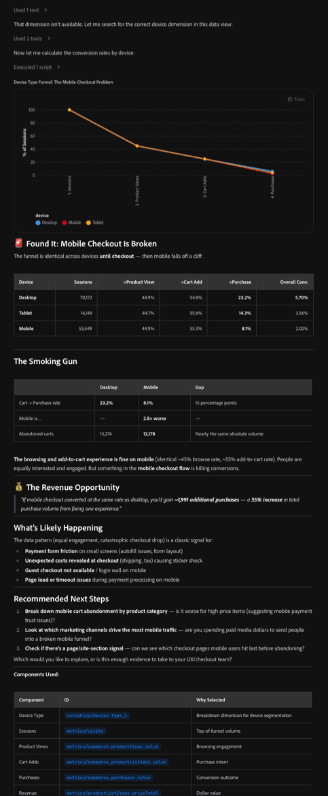

# Perform Customer Journey Analytics data analysis with Coworker

Adobe CX Enterprise Coworker Chat can perform deep data analysis that was previously possible only in Analysis Workspace. Coworker chat accesses data from your Customer Journey Analytics data views and allows you to perform advanced data analysis with simple prompts and exploration.

Before you begin your analysis in Coworker, first log in using your CX Enterprise account, then make sure the Customer Journey Analytics MCP server is connected.

## Log in to Coworker

1. 

## Connect the Customer Journey Analytics MCP server

1. In Coworker, select the MCP icon in the left rail.

   

1. Make sure that [!UICONTROL **cja-mcp**] is available in your list of connected MCP servers.

   

1. (Conditional) If [!UICONTROL **cja-mcp**] is not yet connected, select [!UICONTROL **Add MCP Server**], specify cja in the [!UICONTROL **Server Name**] field and select it when it appears, then select [!UICONTROL **Add Server**].

## Connect to the right data view

I did this. Do users need to? 

## Use case: Find where customers drop off

Any marketing manager, merchandiser, or growth lead wants to understand where customers abandon the path to purchase, why they did, and what can be done to drive higher conversion rates. 

With Coworker Chat, you can simply ask.

>[!NOTE]
>
>The figures below are illustrative sample data for a fictional retailer, TechPulse Electronics, used to show the shape of the conversation.

### The types of questions you can ask

You don't need to know what a "fallout visualization" is, or which metric goes in which slot. Instead, describe the outcome you care about in plain language:

* "Where are we losing people on the way to purchase?"
* "What's my full conversion funnel, from product view to checkout?"
* "Which marketing channels leak the most between cart and purchase?"
* "Is cart abandonment worse on mobile or desktop?"
* "Do people from paid social convert differently than people from email?"

### The conversation

#### 1. Start with the business question

**You:**
> Where are we losing people on the way to purchase?

**Coworker Chat response:**

Notice that Coworker Chat chooses the right visualization, sequences the touchpoints, and even adds recommended next steps.

>
> 
>This is a funnel question — let me run the conversion funnel to see where drop-off happens on the path to purchase.
>
>
>
>Here's where you're losing people:
>
>| Funnel step | Count | Conversion to next | Drop-off |
>| --- | --- | --- | --- |
>| Sessions | 137,476 | 45.0% view a product | 55% leave without browsing products |
>| Product views | 61,845 | 55.0% add to cart | 45% browse but don't add |
>| Cart adds | 34,045 | 16.4% purchase | 83.6% abandon cart |
>| Purchases | 5,582 | — | — |
>
>**The big finding: cart to purchase is your biggest leak**
>
>28,463 people add items to their cart but never complete the purchase. That's an 83.6% cart-to-purchase drop-off rate — by far the largest single point of failure.
>
>To put it in dollar terms, converting just 10% more of those cart-adders would add about 2,846 purchases. At the current data scale, that's potentially significant revenue left on the table.
>
>**What this tells you about priorities:**
>
>| Priority | Problem | Scale of opportunity |
>| --- | --- | --- |
>| #1 | Cart to purchase abandonment (83.6% drop) | 28,463 lost buyers |
>| #2 | Session to product view (55% never browse) | 75,631 sessions without product engagement |
>| #3 | Product view to cart (45% don't add) | 27,800 interested but uncommitted |
>
>**Recommended next steps:**
>
>1. Break down cart abandonment by marketing channel — are certain channels bringing low-intent traffic that adds to cart but never buys?
>1. Look at cart abandonment by device type — is mobile checkout friction killing conversions?
>1. Identify which products get abandoned most — pricing issue? Shipping surprise?
>
>**Which of these would you like me to dig into next?** The channel breakdown would tell you directly which marketing actions are bringing you "almost-buyers" versus actual buyers.

#### 2. Drill into the leak

**You:**
> Okay, let's break down by marketing channel

**Coworker Chat response:**

>

#### 3. Keep investigating

**You:**
>Interesting. Let's trying breaking down by device type.

**Coworker Chat response:**

>

#### 4. Turn it into a decision

**You:**
> So what should I do?

**Customer Journey Analytics:**
> Based on what the data shows, here's where I'd focus:
>
> - **Fix the mobile checkout before spending more on paid social.** The traffic is converting into carts, so the ad spend is working. The revenue is being lost at mobile checkout, which is where the fix belongs.
> - **Start with payment and form friction.** These are the most common reasons high-intent mobile shoppers abandon a cart. Offering mobile wallet options and shortening the form are usually the fastest wins.
> - **Re-check after the fix.** Once checkout changes ship, watch whether mobile paid-social completion moves toward the desktop rate of 44%.
>
> Want me to save this as a project so you can track it, or set an alert if mobile cart-to-purchase drops below a threshold?

### What just happened

In four plain-language questions, someone with no Analysis Workspace training just:

- built a multi-step conversion funnel,
- identified the drop-off that actually threatened revenue,
- broke it down by marketing channel,
- isolated the cause to a specific device experience, and
- walked away with a prioritized action plan.

No fallout configuration. No dragging touchpoints into slots. No waiting on an analyst's queue. The person asked the questions they already had in their head, and the AI did the analytical work — including the judgment calls about which numbers mattered and why.

That's the shift: the questions stay with the business owner, and the expertise comes to them.

